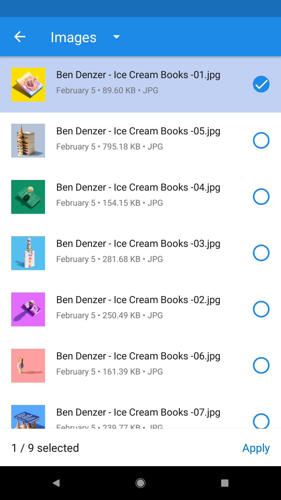
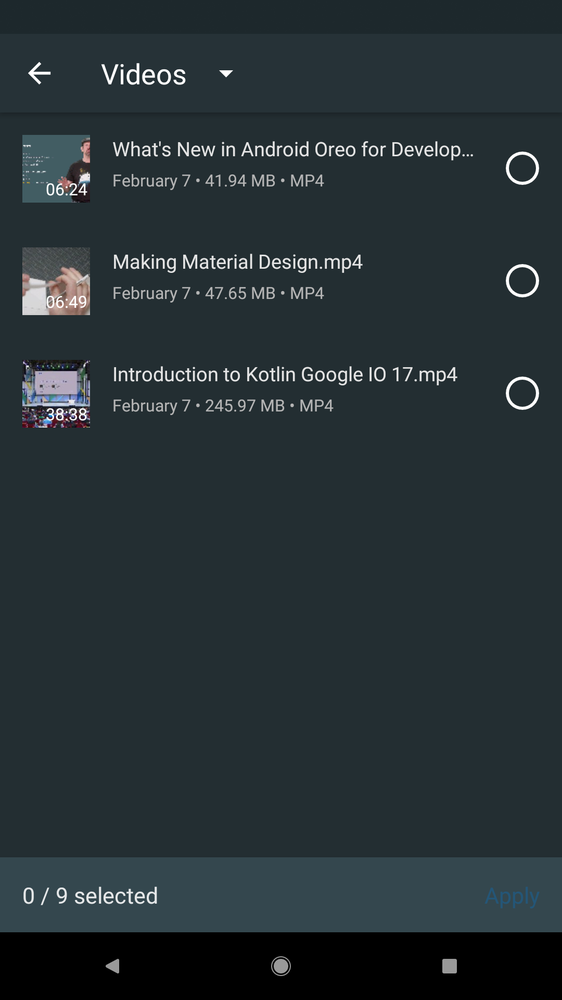
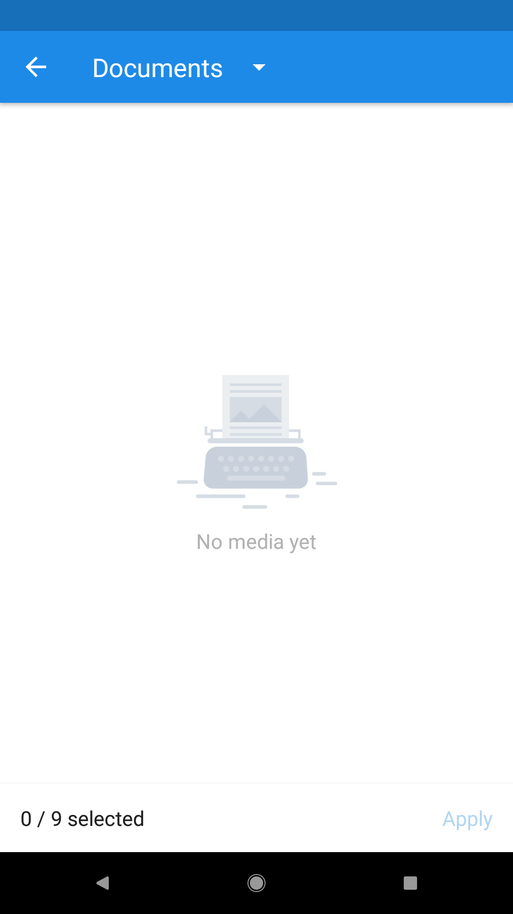

# Charles
[](https://travis-ci.org/TonnyL/Charles)
[ ](https://bintray.com/tonnyl/maven/charles/_latestVersion)

Charles is a local file selector for Android. You can

+ Use it in Activity or Fragment
+ Select multi-media file including images, videos, audio and documents
+ Apply different themes, including two built-in themes and custom themes
+ Restrict different screen orientations
+ Find more by yourself

|  Charles Style  |  Charles Dark Style  |  Empty View  |
| :-------------: | :-------------: | :-------------: |
|  |  |  |

## Download
### Gradle
+ Add the JitPack repository to your root build.gradle file:

```gradle
repositories {
    maven { url "https://jitpack.io" }
}
```

+ Add the code to your **module**'s build.gradle file:

```gradle
dependencies {
    implementation 'io.github.tonnyl:charles:x.y.z'
}
```

### Maven
```xml
<dependency>
  <groupId>io.github.tonnyl</groupId>
  <artifactId>charles</artifactId>
  <version>x.y.z</version>
  <type>pom</type>
</dependency>
```

## ProGuard
If you use [Glide](https://github.com/bumptech/glide) as your image engine, add rules as Glide's README says.
And add extra rule:

```pro
-dontwarn com.squareup.picasso.**
```

If you use [Picasso](https://github.com/square/picasso) as your image engine, add rules as Picasso's README says.
And add extra rule:

```pro
-dontwarn com.bumptech.glide.**
```

**Attention**: The above progurad rules are correct.

## Usage
### Permission
The library requires two permissions:

+ `android.permission.READ_EXTERNAL_STORAGE`
+ `android.permission.WRITE_EXTERNAL_STORAGE`

So if you are targeting Android 6.0+, you need to handle runtime permission request before next step.

### Simple Usage Snippet
Start `CharlesActivity` from current `Activity` or `Fragment`:

```kotlin
Charles.from(this@MainActivity)
        .choose()
        .maxSelectable(9)
        .progressRate(true)
        .theme(R.style.Charles)
        .imageEngine(GlideEngine())
        .restrictOrientation(ActivityInfo.SCREEN_ORIENTATION_UNSPECIFIED)
        .forResult(REQUEST_CODE_CHOOSE)
```

### Themes
There are two built-in themes you can use to start `MatisseActivity`:

+ `R.style.Charles` (light mode)
+ `R.style.CharlesDark` (dark mode)

And Also you can define your own theme as you wish.

### Receive Result
In `onActivityResult()` callback of the starting `Activity` or `Fragment`:

```kotlin
override fun onActivityResult(requestCode: Int, resultCode: Int, data: Intent?) {
    super.onActivityResult(requestCode, resultCode, data)
    if (requestCode == REQUEST_CODE_CHOOSE && resultCode == Activity.RESULT_OK) {
        val uris = Charles.obtainResult(data)
        val paths = Charles.obtainPathResult(data)
        mAdapter.setData(uris, paths)
        Log.d("uris", "$uris")
        Log.d("paths", "$paths")
    }
}
```
### More
Find more details about Matisse in [wiki](https://github.com/TonnyL/Charles/wiki).

## Contribution
Discussions and pull requests are welcomed 💖.

## Thanks
This library is inspired by [Matisse](https://github.com/zhihu/Matisse) and uses some of its source code.

## License
Charles is under the MIT license. See the [LICENSE](LICENSE) for more information.